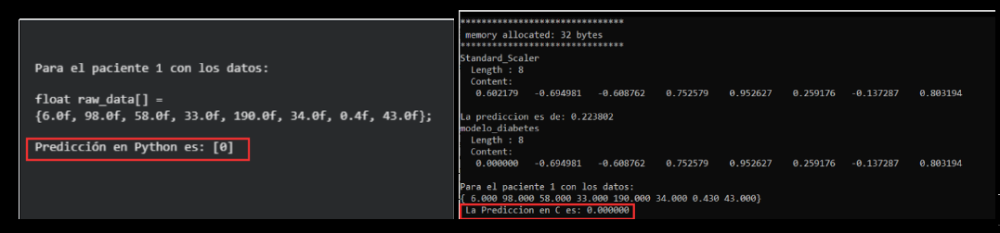
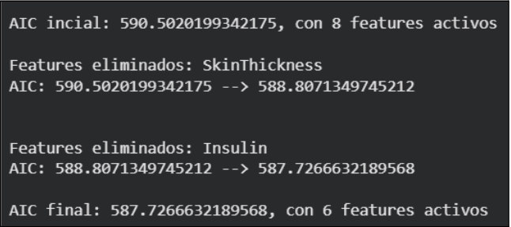
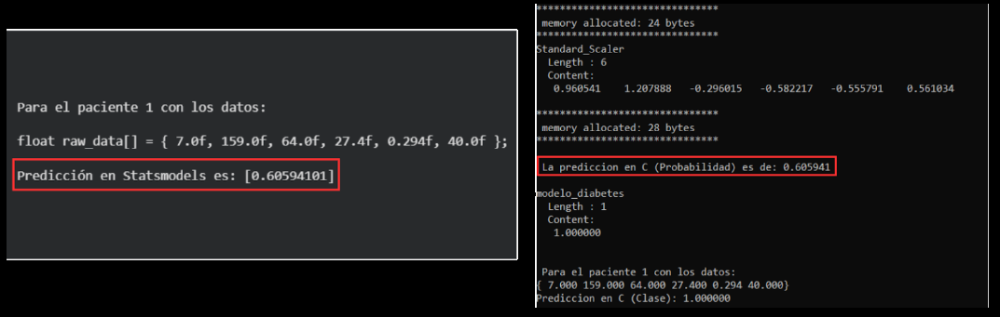

  

  
  <h4><strong>EmbedIA is a machine learning framework for developing applications on microcontrollers.</strong></h4>
  
  
  

EmbedIA is a compact and lightweight framework capable of providing the necessary functionalities for the execution of inferences from Convolutional Neural Network models, created and trained using the Python Tensorflow/Keras library, on microcontrollers with limited hardware resources. It is designed to be compatible with the C and C++ languages for the Arduino IDE, both with support for a wide range of MCUs.

# Integración de Statsmodels en EmbedIA para TinyML

Este proyecto forma parte de mi investigación y desarrollo enfocados en **TinyML y Edge Computing**. El objetivo principal fue extender el framework de código abierto [EmbedIA](https://github.com/Embed-ML/EmbedIA) (desarrollado por el III-LIDI, UNLP) para soportar inferencia estadística rigurosa mediante la integración desde cero de la biblioteca **Statsmodels**.

## 🚀 El Desafío Técnico
Tradicionalmente, los modelos de aprendizaje automático para microcontroladores se exportan utilizando herramientas orientadas exclusivamente a la predicción (como Scikit-learn). Este proyecto introduce un enfoque basado en la **inferencia estadística**, permitiendo simplificar la arquitectura del modelo *antes* de su compilación en C.

**Principales logros del desarrollo:**
* **Desarrollo de Wrapper Personalizado:** Creación de la arquitectura interna (`SMLogisticRegressionWrapper`) para navegar y extraer los parámetros del objeto `BinaryResultsWrapper` de Statsmodels.
* **Optimización Automatizada (Feature Selection):** Implementación de un algoritmo de **Backward Elimination** guiado por el Criterio de Información de Akaike (AIC). 
* **Eficiencia en Hardware (TinyML):** Al aplicar el algoritmo al dataset de diagnóstico de diabetes, se logró reducir el modelo de 8 a 6 características. Esto se traduce en un menor consumo de memoria Flash, menos operaciones MACs y una huella de RAM de **solo 28 bytes** utilizando el sistema de doble búfer del framework.
* **Fidelidad Matemática:** Validación cruzada exitosa. El código exportado en C nativo replica con exactitud de 32 bits las probabilidades generadas en el entorno de desarrollo en Python (precisión comprobada hasta el sexto decimal).

## 🛠️ Tecnologías y Herramientas
* **Lenguajes:** Python (Entrenamiento y Generación), C nativo (Inferencia en hardware).
* **Machine Learning:** Statsmodels (Logit), Scikit-learn (StandardScaler), NumPy, Pandas.
* **Entornos:** Code::Blocks (Validación cruzada y simulación de hardware), Git.

## ⚙️ Arquitectura del Proyecto
El desarrollo requirió la modificación y extensión del *core* del framework:
1. `embedia/core/`: Se agregó `statsmodels_model.py` para registrar la compatibilidad del nuevo motor.
2. `embedia/wrappers/`: Se desarrolló el traductor que aplana (`.flatten()`) y extrae los pesos ($w_i$) y el sesgo ($b_0$) de Statsmodels.
3. `mcu/`: Reutilización de la lógica estática de inferencia (`logistic_regression.c/h`) aplicando la función Sigmoide y la gestión determinista de memoria.

### 🚀 Logros Clave
- ✅ Reducción de modelo de 8 a 6 features vía Backward Elimination (AIC)
- ✅ Uso de memoria RAM: 28 bytes (optimización extrema)
- ✅ Validación cruzada Python-C: precisión decimal idéntica
- ✅ Sistema de doble buffer sin fragmentación de memoria

### 📊 Resultados

  

  
  <h4>Comparación de resultados de Scikit-learn con un respectivo paciente</h4>
  
  <h4>Comparación de AIC para el dataset de diabetes, luego de aplicar el modelo logit</h4>
  
  <h4>Comparación de resultados de Statsmodels con un respectivo paciente</h4>
  

## 👨‍💻 Autor
**Tomás Valentín De Blasio** Ingeniería en Computación | Universidad Nacional de La Plata (UNLP)

*Proyecto desarrollado en el marco de la Práctica Profesional Supervisada (PPS) dentro del proyecto "Sistemas Inteligentes" del Instituto de Investigación en Informática III-LIDI.*